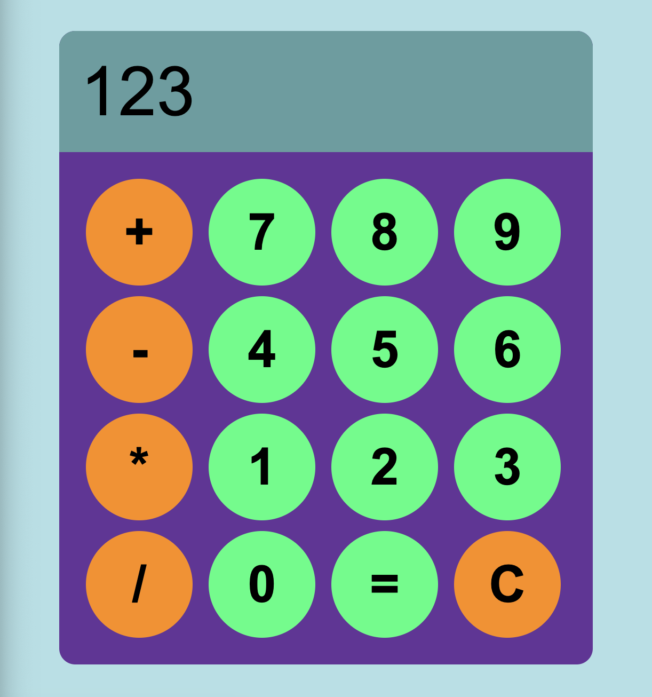

# Simple Calculator

This is a simple calculator web application built using HTML, CSS, and JavaScript.

## Description

This project demonstrates the fundamental principles of web development by creating a functional calculator.

* **HTML (HyperText Markup Language):** Provides the structure and content of the calculator, including buttons, display area, and layout.
* **CSS (Cascading Style Sheets):** Handles the styling and presentation of the calculator, ensuring a clean and user-friendly interface. This includes colors, fonts, button shapes, and overall layout.
* **JavaScript:** Implements the logic and functionality of the calculator. It handles user input, performs calculations, and updates the display. Key functionalities include:
    * Handling button clicks.
    * Parsing input values.
    * Performing arithmetic operations (+, -, *, /).
    * Displaying results.
    * Error handling (e.g., division by zero).

## Usage

1.  Open the `index.html` file in your web browser.
2.  Use the buttons to input numbers and operators.
3.  Click the "=" button to calculate the result.
4.  Click the "C" button to clear the display.

## Files

* `index.html`: The main HTML file containing the structure of the calculator.
* `css/style.css`: The CSS file containing the styles for the calculator.
* `scripts/javascript.js`: The JavaScript file containing the logic of the calculator.
* `images/screenshots.png`: Image of the calculator.

## Contributions

Contributions are welcome! If you find any bugs or have suggestions for improvements, please feel free to submit a pull request or open an issue.

## Copyright

Copyright &copy; 2025 Simple Calculator @aucnom
